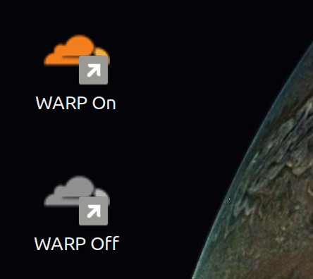

# WARP-cloudflare-desktop-shortcuts
A set of shortcuts and icons to make controlling the Linux WARP install more GUI-ish

## INTRODUCTION

The Linux tool for Cloudflare WARP does not have a management interface akin to the Windows version.

This non-GUIness explained, quite reasonably, in this blog post here: https://blog.cloudflare.com/announcing-warp-for-linux-and-proxy-mode/

It is a good compromise. Get as many installs as possible and worry about the sexy details later.

On my Mint Cinnamon, I had a few issues I needed to overcome. I thought to share in case others might find it useful.

## THE PROBLEM

OK - this is to those:

- Who DON'T want to control their setups via the terminal (understandable) and
- Are experiencing the BUG where the DNS doesn't RESOLVE after turning WARP OFF
- Have installed the WARP client correctly, it works, and one sees the cloud icon in their lower system panel

## ABOUT MY SETUP

My setup is Linux Mint Cinnamon 21 with the WARP CLI installed (instructions are in the links of the article above).

I am NOT a Linux systems expert. Simply someone who enjoys the frustration of fixing trivial problems :) Experts, please accept all my errors, omissions, oversights and horrible ignorance, and feel free to freely correct anything.

Attached is a screenshot showing my desktop.... 

## "INSTILLATION"

Once one has installed WARP, done the `warp-cli register` and `warp-cli connect` thing, there is a directory here `/home/USER/.local/share/warp` that contains the file `accepted-tos.txt`.

I've made up SIX files to be put there. It seemed like a logical/reasonable place (this isn't a stand alone project).

The files are:

- warp.off.png
- warp.on.png
- warp.on.sh
- warp.off.sh
- WARP On.desktop
- WARP Off.desktop

The idea is:

- The shell files fire off the needed commands to both start and stop the warp-cli properly. They also "fix" the DNS problem that using the disconnect command causes.
- There is a desktop icon to simply hit for on/off
- There is an ico file to make each icon look nice

Doings:

- Unzip the GIT below into `/home/USER/.local/share/warp` (or anywhere)
- Modify the *.sh files to be executable.... `sudo chmod +x warp.off.sh warp.on.sh`
- Drag the two .desktop files onto the desktop
- EDIT the TWO .desktop files to add your machines USERNAME instead on mine ('msi')

e.g.

    $ Exec=/home/msi/.local/share/warp/warp.off.sh
    $ Icon=/home/msi/.local/share/warp/warp.off.png

Replace `msi` part with your login name (`RumpleStiltskin` or whatever)

TEST by tapping the icons. The Cloudflare connection icon in thy taskbar should now turn on and off appropriately, plus you'll have lovely WARPy internet.

## ACKNOWLEDGEMENTS

I wished to acknowledge the fine work and inspiration of MrMoein in this project: https://github.com/mrmoein/warp-cloudflare-gui

It worked very well, but I became trapped by the accursed DNS-not-restting bug caused by systemd-resolved, the myriad of ways networking is configured in Linux distros. The Cloudflare WARP team does what it can, but their priorities are on bulk at the moment.... :)
